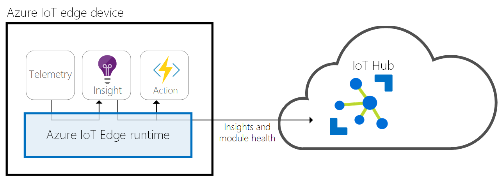
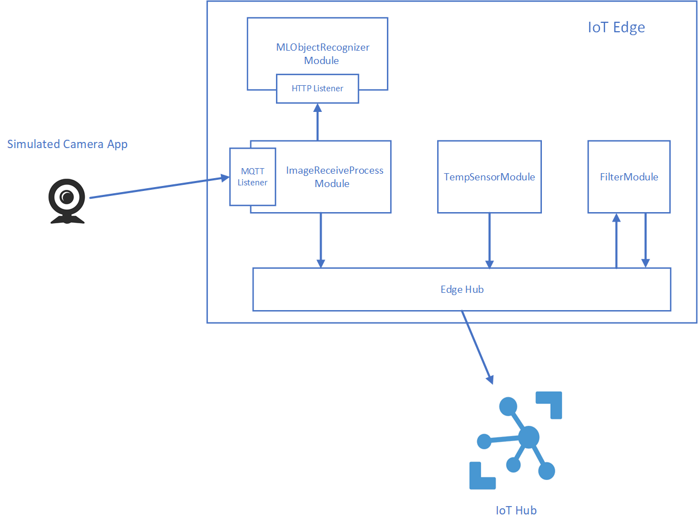
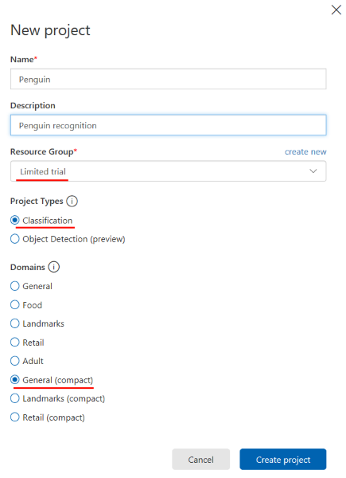
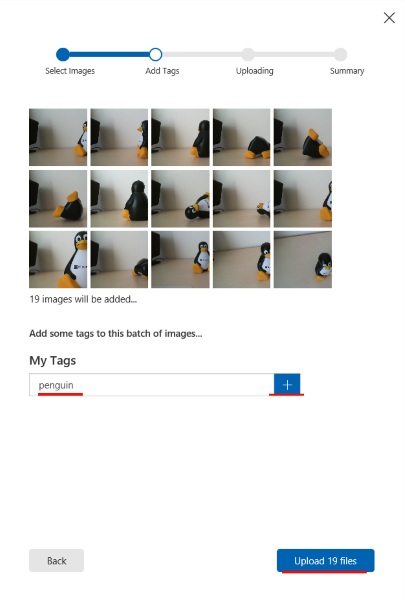
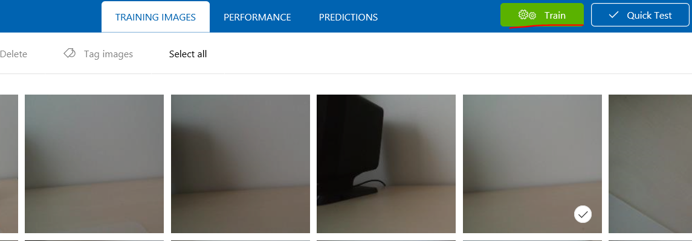
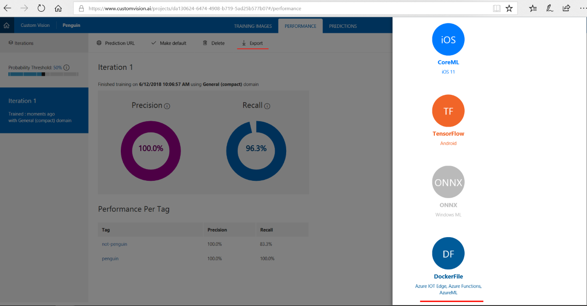
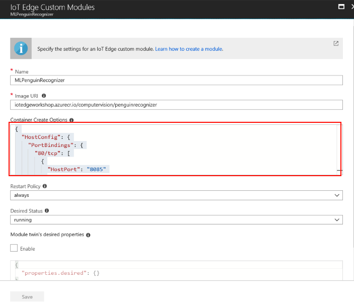
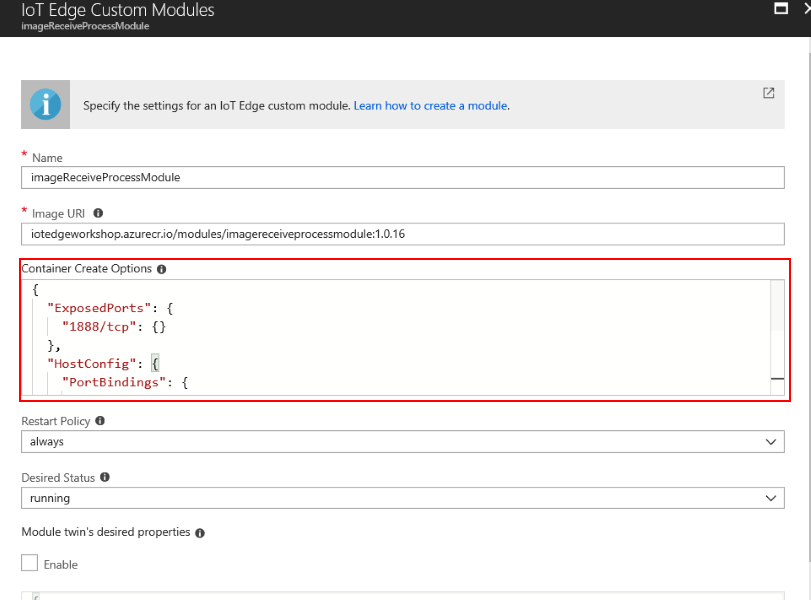

# Azure IoT Edge Workshop

In this workshop we will get familiar with Microsoft's service called [Azure IoT Edge](https://azure.microsoft.com/en-us/services/iot-edge/). Azure IoT Edge enables you to create solutions built on principles of Edge Computing. From definition Edge Computing is method of optimizing cloud **computing** systems "by taking the control of **computing** applications, data, and services away from some central nodes (the "core") to the other logical extreme (the "**edge**") of the Internet" which makes contact with the physical world ([Wikipedia](https://en.wikipedia.org/wiki/Edge_computing)). In other words, the end IoT Devices are playing still bigger and bigger role in computational tasks, originally performed by central nodes, whether hosted on premise or in cloud. Utilizing edge computing, end solution can benefit from quicker and cheaper processing, even offline. Of course power of cloud stays in the frame, for instance in case of data analysis or in heavy tasks like training of huge machine learning models.   

**Azure IoT Edge** is edge computing service built on top of Docker containers, which allows you to move move parts of data processing and your business logic to Edge devices. It allows you to collect, filter and aggregate  data or even run machine learning algorithms directly on IoT Devices. IoT edge consist of Edge Hub, which serves as a sink and router of messages - in a way as a service bus and modules you deploy, which are  responsible for message processing (in some cases receiving as well).  IoT Edge is managed and deployed thru Azure IoT Hub service. Besides management tasks connected to deployment of Azure IoT Edge and modules, IoT Hub serves as a sink for messages which are sent to cloud. These messages can be for instances aggregated sensor values, data needed for Machine Learning Model retraining etc. , simply said, data that need more computational power to be processed or need to be archived. IoT Edge is capable to run on **Windows**, **Linux** or even **MAC** machines.

Bellow we are stating general diagram explaining IoT Edge communication flow:




**Prerequisites:**

In this workshop you will need Azure subscription. If you do not have one, you can create free trial using this link: https://azure.microsoft.com/en-us/free

Other prerequisites are mentioned for every part of the workshop separately 


## Workshop solution

During workshop we will create simulated IoT Edge device deployed to our development machine and we will deploy several modules to it as well. We will go thru following tasks: 

- **Create simulated IoT Edge Device and deploy Temperature Sensor simulator module **(simulated temperature sensor slowly increases temperature value and this way simulates overheating.) 
- **Create custom filtering module**, which will receive messages from Temperature Sensor and if the value exceeds threshold it will forward message to IoT Hub (to cloud).
- **Create custom vision machine learning model and deploy it to Azure IoT Edge as a module**. In our solution, this module will be capable to recognize TUX (Linux penguin) in the picture.
- **Create image receiving and processing module.** This module will communicate with object recognizer module and will be capable to receive images from simulated camera device
- **Test the solution using simulated camera device**
- **Additional tutorials** 

Below we are stating architecture of the solution we will create:




## Create simulated IoT Edge Device and deploy Temperature Sensor simulator module

To create simulated IoT Edge device and to deploy Temperature Sensor simulator module please follow official tutorial. Select based on the platform you use on your dev machine:

- [Deploy Azure IoT Edge on a simulated device in Windows -  preview](https://docs.microsoft.com/en-us/azure/iot-edge/tutorial-simulate-device-windows) 
- [Deploy Azure IoT Edge on a simulated device in Linux or MacOS - preview](https://docs.microsoft.com/en-us/azure/iot-edge/tutorial-simulate-device-linux)

**Note1**: When writing this article we were facing **problem with Windows Docker Image for simulated Temperature Sensor**. It was having problems related to authentication and certificates. If you face the same issue, please use this Image: [mareklani](https://hub.docker.com/u/mareklani/)/[iotedgetempsensor:latest](https://hub.docker.com/r/mareklani/iotedgetempsensor/) , we built from Simulated Temperature Sensor sample app. Eventually you can clone the sample from this [github repo](https://github.com/Azure/iot-edge/tree/master/v2/samples/azureiotedge-simulated-temperature-sensor) and build the image by yourself.

**Note2:** If you face **backoff** status for any module, please delete it thru Azure IoT Edge management environment on Azure portal and then reconnect your IoT Edge device using *iotedgectl setup command*.


## Creating custom filtering module

To create custom message filtering module, which will filter messages generated by temp sensor module, we will use .NET Core template. To create custom module please follow this tutorial: https://docs.microsoft.com/en-us/azure/iot-edge/tutorial-csharp-module 

**Note!:** When writing this article, we were facing issues with Visual Studio Code support to build and push Docker image of the module using context menu (when right clicking module.json file) If you face the same issue, you can still do this manually using following way:

- In terminal window of VS Code navigate to folder with dockerfiles for your modules

- Ensure you are logged into the Azure Container Registry, if not use command:  

  ```bash
  docker login <yourregistryname>.azurecr.io -u username -p password
  ```

  

- Use following commands to build, tag and push the image:

  ```bash
  docker build -t <yourmoduleimagename>  -f  <DockerFileForYourPlatform> .
  docker tag <yourmoduleimagename> <yourregistryname>.azurecr.io/modules/<yourmoduleimagename>
  docker push <yourregistryname>.azurecr.io/modules/<yourmoduleimagename>
  ```

  

## Creating custom vision machine learning model and deploying it to Azure IoT Edge as a module

We will create custom vision module using Custom Vision service, which is part of Azure's [Cognitive Services](https://azure.microsoft.com/en-us/services/cognitive-services/) offering, which enables you to use rich Artificial Intelligence capabilities in a very easy way, using REST requests. We will train our own model to recognize whether there is TUX (Linux penguin) in the picture or not, subsequently we will export it, we will build  docker image containing the trained model, we will upload this image to Azure Container registry you have created in the first step of this workshop and finally we will deploy it as a module to our simulated IoT Edge device.

As a **prerequisite** in this step, please clone [this github repository](https://github.com/MarekLani/AzureIoTEdgeWorkshop), where you will find sample code and images, that we will be using for training of custom vision model. As we will be creating classification model, it is good practice to feed model with positive and negative examples, that means with pictures contain object we will be recognizing and pictures which does not contain it.

### Creating custom vision project and exporting model

As said, we will start with creation of our own object recognition model.

1. Navigate to https://www.customvision.ai/ and sign in using the same credentials you used for login to Azure environment.

2. After logging in click "Create Project"

3. Provide the name and description for the project. You can choose Limited Trial as a resource group, choose *Classification* for project type and *General (compact)* domain. 

   

   

   **Note:** To be able to export the model after we train it, we need to create it as a compact one. It will provide slightly lower precision than non-compact one, but it will be much more lightweight and exportable. Besides classification, which gives us information whether specific object is in the picture or not, there is possibility to create model for object detection, which on top of classification provides coordinates of object's bounding box. Object detection model is however not exportable in the current moment.

4. In the project page click Add Images

5. Click browse local files. Navigate to folder *TrainingImages/Positive* of the cloned repository and select all the images. In next step provide tag *penguin*, click *plus button* and then click *Upload Images*.

   

6. After successful upload of images you should be directed again to project dashboard, where you should see images you just uploaded. Repeat the image upload for negative sample images, which you can find in  *TrainningImages/Negative* folder. When tagging images, use *noPenguin* tag.

7. After negative samples are uploaded, click *Train* button in the project dashboard page.

   

   

8. After model is trained, navigate to **PERFORMANCE** page, where you will be displayed page with training results, which should be quite good. 

   Note: If you expect different background in the pictures in which you will be recognizing the object, you should feed the model with pictures with various backgrounds, so it can be precisely trained to isolate the object, you need to recognize.

9. Now click *export* and select *DockerFile* option.

   

10. Choose platform based on OS you are running on your dev machine and click export. You should see download dialog. Choose location where you want to download the model. Extract the downloaded archive file. 


### Building docker image with trained model and pushing it to registry

When you extract the archive with trained model, open included **Readme.txt** file. Here you can see instructions how to build and how to run and test image running in container.

**Note**: If you are using **Windows** to run the IoT Edge simulated device, there is extra step needed. Base Windows docker image, used to build image with trained model, does not contain library you need to run the app. Namely it is **msvcp140.dll** library which is part of Microsoft Visual C++ Redistributable package. Before building the image, we need to copy this library to the **app folder**. You should have the C++ Redistributable packages at least in version 2015 Update 3 installed on your machine. If not please download it from this site: https://www.microsoft.com/en-us/download/details.aspx?id=53587 . You will find the library in `*%windir%*\System32`  directory. Copy it to **app folder** located in directory where you have extracted the exported model.

Once you built docker image using  *"docker build -t <yourImageName> ."* we will need to upload the image to Azure Container registry, before we are able to deploy it to Azure IoT Edge device. Please follow these steps:

1. Ensure you are running docker and that your are logged into Azure Container registry from docker environment. If not run 

   ```bash
   docker login <yourRegistry>.azurecr.io -u <xxxxxxxx-xxxx-xxxx-xxxx-xxxxxxxxxxxx> -p <yourPassword>
   ```

2. Tag your image

   ```bash
   docker tag <yourImageName> <yourRegistry>.azurecr.io/<yourImageName>
   ```

3. Push it to Azure Container Registry

   ```bash
   docker push <yourRegistry>.azurecr.io/<yourImageName>
   ```

   

### Deploying container with trained model to IoT Edge device

To deploy trained model to IoT Edge device, please follow steps used to deploy filter module in previous section of this tutorial while referencing your image ("*docker push <yourRegistry>.azurecr.io/<yourImageName>*"), with one  more change. As we need to enable communication with our container, in other words we need requests sent to our host machine to be directed to our container, we will **create port binding** - NAT rule for the container. Our application with trained model is accessible on port 80. We will map this port of container to port 8085 on our host machine. To achieve this please set following *Create Container Options*. Use *MLPenguinRecognizer* as a module name.

```json
{
  "HostConfig": {
    "PortBindings": {
      "80/tcp": [
        {
          "HostPort": "8085"
        }
      ]
    }
  }
}
```




You can leave route setting unchanged now, as we will not be using Edge Hub message broker to route request, but rather we use direct request to module using http protocol. As IoT Edge supports python modules as well, as an "extra task" after finishing this workshop you can try to change the code of module, so it wires up to IoT Edge messaging engine.

### Testing deployed module

Once module is deployed we can test it using HTTP request generator tool. In the README.txt file you can find request examples using CURL. Model supports multiple ways, how you can send the image to it. Below we are showing example using tool call **[Postman](https://www.getpostman.com/)**. 

Set the address to *localhost:8085*, set *Content-Type header to application/octet-stream* and body of the request to *binary* and choose file you want to upload.


When you submit picture with TUX penguin in it, you should see following result:

```json
{
    "created": "2018-06-16T18:13:30.517394",
    "id": "",
    "iteration": "",
    "predictions": [
        {
            "boundingBox": null,
            "probability": 1,
            "tagId": "",
            "tagName": "penguin"
        }
    ],
    "project": ""
}
```

We have successfully deployed our own custom vision model to IoT Edge device and tested it. In next step, we will create module, which will provide MQTT listener for receiving of pictures and which will take care of communication with the custom vision module.


## Create image receiving and processing module.

In this section we will create module, which will be capable to receive pictures sent thru MQTT protocol, call the object recognizer module and output message with processing results to Edge Hub. To create module follow these steps:

1. Create new module using Visual Studio Code and name it ImageReceiveProcessModule (Run following command in terminal Window:

   ```bash
   dotnet new aziotedgemodule -n ImageReceiveProcessModule -r <your container registry address>/imagereceiveprocessmodule
   ```

   

2.  Install **MQTTnet** nuget package. This package will allow us to create MQTT listener. 

   

   Note: To manage nuget packages in Visual Studio Code we recommend Nuget Package Manager extension (https://marketplace.visualstudio.com/items?itemName=jmrog.vscode-nuget-package-manager). More details on how to add extensions to Visual Studio Code can be found here: https://code.visualstudio.com/docs/editor/extension-gallery . Once you have have installed the extension you can use it in Command Pallete Windows (open by CTRL + SHIFT + P) using >*Nuget Package Manager: NameOfCommand*

   

3. Add following *usings* to the beginning of *Program.cs* file:

   ```
   using MQTTnet.Server;
   using MQTTnet;
   using System.Net.Http;
   using Newtonsoft.Json.Linq;
   using System.Net;
   using System.Linq;
   ```

   

4. In next step we need to create MQTT listener. We will do this in *Init* method. Paste following code right after the section where the connection to Edge Hub is established:

   ```c#
   // Open a connection to the Edge runtime
   DeviceClient ioTHubModuleClient = DeviceClient.CreateFromConnectionString(connectionString, settings);
   await ioTHubModuleClient.OpenAsync();
   
   //Copy from here
   //Start MQTT Server on port 1888
   var optionsBuilder = new MqttServerOptionsBuilder()
       .WithConnectionBacklog(100)
       .WithDefaultEndpointPort(1888);
   
   var mqttServer = new MqttFactory().CreateMqttServer();
   mqttServer.StartAsync(optionsBuilder.Build()).Wait();
   
   //On Message Received log to console, and output to IoT Edge Hub
   mqttServer.ApplicationMessageReceived += new EventHandler<MqttApplicationMessageReceivedEventArgs>( async (o, mqttArgs) => {
   
       var file = Encoding.UTF8.GetString(mqttArgs.ApplicationMessage.Payload);
   
       //Call Exported TensorFlow model
       HttpResponseMessage response = await SendRequestToML(Convert.FromBase64String(file));
       if(response == null)
           return;
   
       //Process response -> if we find penguin, we notify IoT Hub (cloud)
       JObject jobject = JObject.Parse(await response.Content.ReadAsStringAsync());
       Console.WriteLine(await response.Content.ReadAsStringAsync());
       if (jobject.GetValue("predictions")[0]["tagName"].ToString() == "penguin" && Convert.ToDouble(jobject.GetValue("predictions")[0]["probability"]) > 0.5)
           await ioTHubModuleClient.SendEventAsync("output2", new Message(Encoding.UTF8.GetBytes("{\"IsPenguin\" : "+true+" }")));
       
       //Please comment out original Pipe message processing
       // Console.WriteLine("IoT Hub module client initialized.");
       // // Register callback to be called when a message is received by the module
       // await ioTHubModuleClient.SetInputMessageHandlerAsync("input1", PipeMessage, ioTHubModuleClient);
   });
   ```

5. As a next step we need to implement *SendRequestToML* method which takes care of communication with our MLPenguinRecognizer module. Paste code of following method  to Program class.

   ```C#
   static  async Task<HttpResponseMessage> SendRequestToML(byte[] content)
   {
       try{
   
           using (var formDataContent = new MultipartFormDataContent())
           {
   
               //Use format: curl -X POST http://127.0.0.1/image -F imageData=@some_file_name.jpg
               formDataContent.Add(new ByteArrayContent(content), "imageData", "photo");
               using (HttpClient httpClient = new HttpClient())
               {
   
                   //To create rest request using HTML client, we need to Get Host Entry for ML Module Alias    
                   IPHostEntry host = Dns.GetHostEntry("MLPenguinRecognizer");
   
                   //We use inner PORT as we are calling from internal docker network
                   HttpResponseMessage response = await httpClient.PostAsync($"http://{host.AddressList.FirstOrDefault().ToString()}:80/image", formDataContent);
                   return response;
               }
           }
       }
       catch(Exception e)
       {
           Console.WriteLine(e.Message);
           return null;
       }
   }
   ```

   

**Please notice** how we obtain address of the MLPenguinRecognizer module. Docker is capable to understand to network adresses using aliases of containers, but this does not work with the HttpClient used in our C# Code. We needed to obtain IP address of container. We named our custom vision module ***MLPenguinRecognizer***. If you have used different name for your custom vision module, please change the name in the code. We can obtain IP address using *DNS.GetHostEntry method*. Also notice that we are calling module on port 80 and not 8085 which we used within port binding. The reason behind this is that both modules are running within the same Docker network, thus we need to use internal container port. 

As a next step build and push container to Azure Container Registry. Follow steps from Filter Module tutorial. Note that you may be forced to do this steps manually as stated in Create custom filtering module.

Once you pushed container, proceed to Azure Portal and create new module for your IoT Edge device. Again follow the same steps as before, name your module ***imageReceiveProcessModule*** and provide following Container Create Options. As Port 1888 is not exposed by default, we need to expose it besides creating port binding. 

```json
{
  "ExposedPorts": {
    "1888/tcp": {}
  },
  "HostConfig": {
    "PortBindings": {
      "1888/tcp": [
        {
          "HostPort": "1888"
        }
      ]
    }
  }
}
```

 


Also change the **routes**, so the output messages are forwarded to upstream (IoT Hub in cloud). Routes should be defined like this:

```json
{
  "routes": {
    "sensorToFilter": "FROM /messages/modules/tempSensor/outputs/temperatureOutput INTO BrokeredEndpoint(\"/modules/filterModule/inputs/input1\")",
    "filterToIoTHub": "FROM /messages/modules/filterModule/outputs/output1 INTO $upstream",
    "recognizerToIoTHub": "FROM /messages/modules/imageReceiveProcessModule/outputs/output2 INTO $upstream",
  }
}
```

**Note**: If you decided to name your modules in different way, please change the names in route respectively. 


## Testing the solution using simulated camera device

Now when you successfully deployed module for receiving and processing of image, we can test it. To do so, please open  *SimulatedCameraDevice* project and run it (clone [this repository](https://github.com/MarekLani/AzureIoTEdgeWorkshop) if you haven't done so before) . This application is simple console application, which let's you select pictures to be sent to our module which provides MQTT listener. There are three pictures which has TUX (Penguin) in it and one without it. These pictures were not used during training of the Custom Vision model. You can select which picture will be sent by providing input values in console window. Application then encodes selected picture to Base64 string and sends it to MQTT listener of our ImageReceiveProcessModule.  

**Note**: If you have used different port for MQTT listener, locate following line in Program.cs of SimulatedCameraDevice application and change it to your port number.

```c#
 var options = new MqttClientOptionsBuilder()
                .WithTcpServer("127.0.0.1", 1888) 
                .Build();
            
```

Now  you can use Azure IoT Toolkit extension in Visual Studio Code, to check whether messages are directed to IoT Hub. Below we are copying instructions from tutorial in which you created filterModule.

To monitor device to cloud messages sent from your IoT Edge device to your IoT hub:

1. Configure the Azure IoT Toolkit extension with connection string for your IoT hub: 

   1. Open the VS Code explorer by selecting **View** > **Explorer**. 

   2. In the explorer, click **IOT HUB DEVICES** and then click **...**. Click **Set IoT Hub Connection String** and enter the connection string for the IoT hub that your IoT Edge device connects to in the pop-up window. 

       To find the connection string, click the tile for your IoT hub in the Azure portal and then click **Shared access policies**. In **Shared access policies**, click the **iothubowner** policy and copy the IoT Hub connection string in the **iothubowner** window.   

2. To monitor data arriving at the IoT hub, select **View** > **Command Palette** and search for the **IoT: Start monitoring D2C message** menu command. 

3. To stop monitoring data, use the **IoT: Stop monitoring D2C message** menu command. 

   

You can as well access logs generated by container using docker logs <nameOfContainer> command. In our case it is:

```bash
docker logs imageReceiveProcessModule
docker logs MLPenguinRecognizer
```


Now we have successfully implemented object recognition functionality and deployed it to Azure IoT Edge, which can provide us results faster, using available and free computational resources and even in offline mode. These are the biggest benefits that edge computing brings to us and thanks to Azure IoT Edge, there is clear programming and deployment model, which enables us to move some parts of our computational tasks to the edge, while we can still easily leverage huge computational resources available in the cloud for more difficult tasks, such as analytics on top of collected aggregated data, training of ML models and so on. 


## Additional tutorials

As a next step, we very much encourage you to go thru additional tutorials stated in official documentation for IoT Edge. In these  deploy [Azure Stream Analytics job](https://docs.microsoft.com/en-us/azure/iot-edge/tutorial-deploy-stream-analytics) and [Azure Function](https://docs.microsoft.com/en-us/azure/iot-edge/tutorial-deploy-function) to IoT Edge simulated devices. 

Azure Stream Analytics is service, which let's you process stream of data using SQL Like queries supporting time windowing (e.g. easily calculate average value for messages within 30 minutes window) now deployable also to IoT Edge.  

Azure Functions module deployed to IoT Edge enable you to easily implement logic which needs to be executed as a reaction to specific event on the edge devices.

Please find more information on the [official documentation page](https://docs.microsoft.com/en-us/azure/iot-edge/how-iot-edge-works).